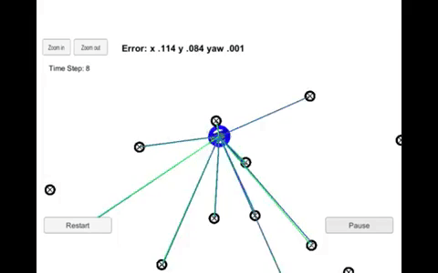

# Kidnapped Vehicle Project
## Overview 
The car has been kidnapped and transported to a new location! Luckily, it has a map of this location, a (noisy) GPS estimate of its initial location, and lots of (noisy) sensor and control data.

In this project we will implement a 2-dimensional particle filter in C++. The particle filter will be given a map and some initial localization information (analogous to what a GPS would provide). At each time step the filter will also get observation and control data. 

## Running the Code 
This project involves the Term 2 Simulator which can be downloaded here.

This repository includes two files that can be used to set up and install uWebSocketIO for either Linux or Mac systems. For windows you can use either Docker, VMware, or even Windows 10 Bash on Ubuntu to install uWebSocketIO.

Once the install for uWebSocketIO is complete, the main program can be built and ran by doing the following from the project top directory. 
1. mkdir build 
2. cd build 
3. cmake .. 
4. make 
5. ./particle_filter

Alternatively some scripts have been included to streamline this process, these can be leveraged by executing the following in the top directory of the project: 
1. ./clean.sh 
2. ./build.sh 
3. ./run.sh

#### INPUT: values provided by the simulator to the c++ program

* sense noisy position data from the simulator
["sense_x"]
["sense_y"]
["sense_theta"]

* get the previous velocity and yaw rate to predict the particle's transitioned state
["previous_velocity"]
["previous_yawrate"]

* receive noisy observation data from the simulator, in a respective list of x/y values
["sense_observations_x"]
["sense_observations_y"]

#### OUTPUT: values provided by the c++ program to the simulator

* best particle values used for calculating the error evaluation
["best_particle_x"]
["best_particle_y"]
["best_particle_theta"]

* Optional message data used for debugging particle's sensing and associations

* for respective (x,y) sensed positions ID label
["best_particle_associations"]

* for respective (x,y) sensed positions
["best_particle_sense_x"] <= list of sensed x positions
["best_particle_sense_y"] <= list of sensed y positions

## Particle filter steps
All the particle filter functions are in the particle_filter.cpp file: The most important are: 
* Initialization function: initialize the 100 particles using the GPS data with random noise added. 
* Prediction function: predict the position and orientation of the car given the velocity and yaw rate. 
* Update Weights function: Transform the landmark observation to map coordinate system, associate them to the closest landmark and evaluate the multivariate gaussian distribution which will define the particle weight. 
* Resample function: Replace the old particles with new ones picked with a probability proportional to the normalized weight.

## Results 
The implemented particle filter met the requirements and successfully completed the 100 seconds simulation.

In fact, using 100 particles, it is able to detect the pose with an error less than 1 meter for the x and y coordinates and less than 0.05 rad for the orientation.
